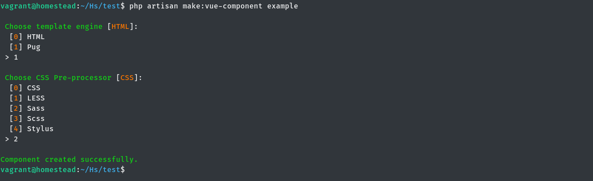
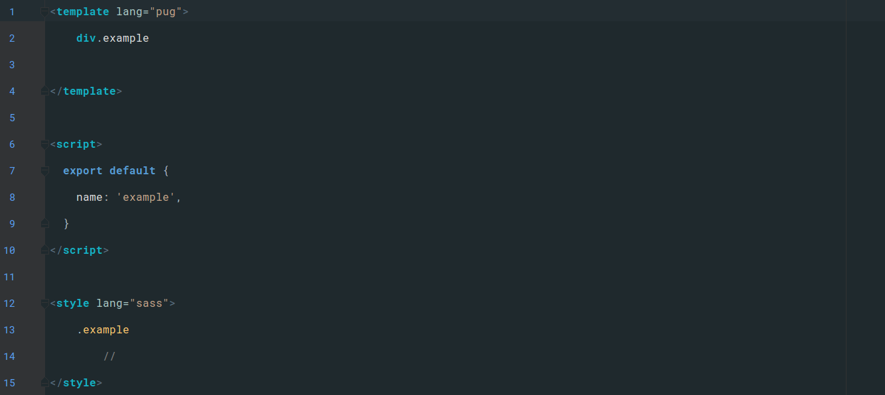

# Laravel Vue Component Generator

## Introduction

> If you love to use Artisan and Vue is the frontend framework of your choice, this package is for you! The `laravel-vue-component-generator` package gives you a new Artisan command which lets you generate the Vue component very fast. 

## Artisan Command

```
php aritsan make:vue-component {name}
```
> During the command execution you have to choose the template engine `(HTML / pug)` and the CSS Pre-prosessor `(CSS / LESS / Sass / Scss / Stylus)`. The Vue component will be generated to `/resources/assets/js/components/` with boilerplate based on your choice. 


## Code Example

> 

> `Example.vue` is created to `/resources/assets/js/components/` 

> Here is the component boilerplate:   

>   


## Installation

```
composer require suomato/laravel-vue-component-generator
```
> After that, add the ServiceProvider to the providers array in `config/app.php`

```
Suomato\VueComponentGenerator\VueComponentGeneratorServiceProvider::class,
```

> Enjoy using the new Artisan command. 

## Config

> If you don't want to choose the same template engine and CSS Pre-processor over and over again or if you're not happy with the default boilerplate, feel free to edit config or views. To publish the config and views use:
```
php artisan vendor:publish --provider="Suomato\VueComponentGenerator\VueComponentGeneratorServiceProvider"
```

- Config is located `/config/vue-component-generator.php`   
- Views is located `/resources/views/vendor/laravel-vue-component-generator`